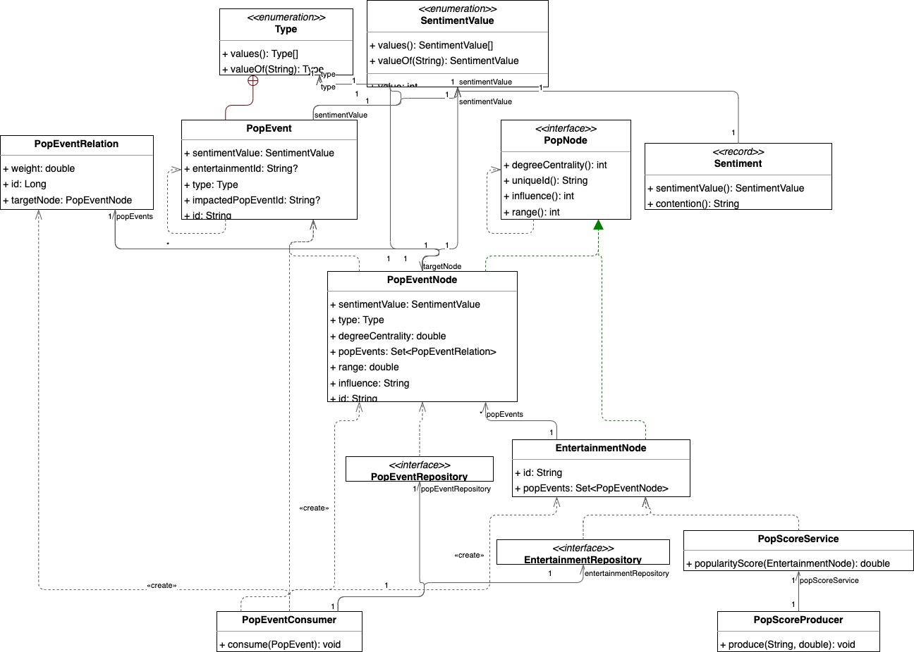

# Demo of Graph Models with Spring Data Neo4j

This repository demonstrates how to work with graph models and modelize graph data structures using the Spring Data Neo4j framework. It includes examples and best practices for defining entities, relationships, and queries, leveraging the power of Neo4j graph database to handle complex, connected data. Whether you're new to graph databases or looking to enhance your application with graph-based data models, this repository provides a guide to get you started.

## Demo Application Architecture

